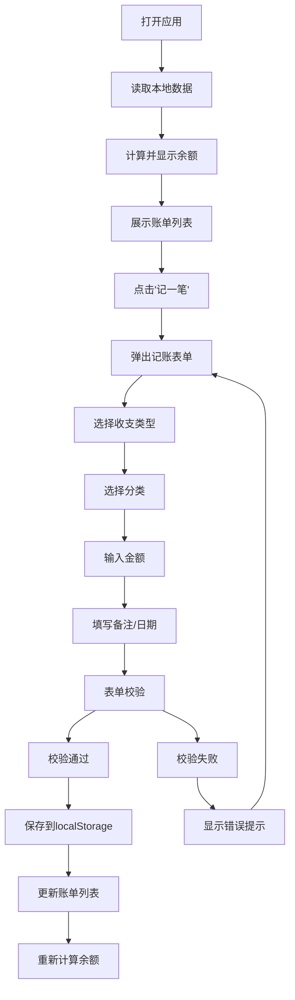

## 1. 产品概述

CoinKeeper 是一款简洁易用的个人记账网页应用，帮助用户快速记录日常收支，实时掌握个人财务状况。

- 核心价值：提供轻量级、无需注册的个人记账体验，数据本地存储，隐私安全
- 目标用户：有记账需求的个人用户，追求简单高效的财务管理工具
- 产品定位：纯前端、本地化、极简设计的个人记账工具

## 2. 核心功能

### 2.1 用户角色

| 角色 | 注册方式 | 核心权限 |
|------|----------|----------|
| 普通用户 | 无需注册 | 记录收支、查看账单列表、管理本地数据 |

### 2.2 功能模块

1. **首页**：余额概览、记账入口、账单列表
2. **记账录入**：弹窗表单、收支类型切换、分类选择、金额/备注/日期录入
3. **账单列表**：按日期倒序展示、收支金额颜色区分、分类图标显示

### 2.3 页面详情

| 页面名称 | 模块名称 | 功能描述 |
|-----------|-------------|---------------------|
| 首页 | 余额概览 | 显示当前账户余额（总收入 - 总支出） |
| 首页 | 记账按钮 | 顶部"记一笔"按钮，点击弹出记账表单 |
| 首页 | 账单列表 | 按日期倒序展示所有收支记录，显示金额、分类、备注、日期 |
| 记账表单 | 类型选择 | 切换收入/支出类型，动态显示对应分类 |
| 记账表单 | 分类选择 | 支出分类：餐饮、交通、购物、娱乐；收入分类：工资、兼职、其他 |
| 记账表单 | 金额输入 | 输入金额，校验必须为正数 |
| 记账表单 | 备注输入 | 可选备注信息 |
| 记账表单 | 日期选择 | 选择记账日期，默认当天 |
| 记账表单 | 表单校验 | 金额必填且为正数、分类必选 |

## 3. 核心流程

用户打开应用 → 查看当前余额 → 点击"记一笔" → 选择收支类型 → 选择分类 → 输入金额 → 填写备注和日期 → 提交保存 → 账单列表更新，余额重新计算

## 4. 用户界面设计

### 4.1 设计风格

- **主色调**：暖橙色系（#F97316），代表财富与活力
- **辅助色**：绿色（#22C55E）表示收入，红色（#EF4444）表示支出
- **中性色**：深灰（#1F2937）文字，浅灰（#F3F4F6）背景
- **按钮风格**：圆角矩形，带悬停动效，主按钮橙色填充
- **字体**：现代无衬线字体，清晰易读
- **布局风格**：卡片式设计，顶部导航 + 内容区域，居中布局
- **图标风格**：使用 lucide-react 线性图标，简洁统一

### 4.2 页面设计概述

| 页面名称 | 模块名称 | UI 元素 |
|-----------|-------------|-------------|
| 首页 | 顶部栏 | 应用 Logo、"记一笔"主按钮、余额显示卡片 |
| 首页 | 余额卡片 | 大字体余额数字、收入/支出统计小字、渐变背景 |
| 首页 | 账单列表 | 列表项卡片、分类图标圆形背景、金额右对齐着色、日期备注小字 |
| 记账表单 | 弹窗 | 半透明遮罩、居中白色卡片、顶部标题和关闭按钮 |
| 记账表单 | 类型切换 | 分段控制器，收入/支出选项卡切换 |
| 记账表单 | 分类选择 | 图标网格布局，点击选中高亮 |
| 记账表单 | 输入区域 | 带图标的输入框、日期选择器、提交按钮 |

### 4.3 响应性

- 桌面端优先设计，最大宽度 640px 居中显示，模拟移动端 App 体验
- 移动端自适应，全屏宽度显示
- 触摸优化：按钮最小高度 44px，分类选择区域足够大便于点击

### 4.4 交互动效

- 页面加载：账单列表项淡入上移动画
- 按钮点击：缩放反馈效果
- 弹窗出现：缩放 + 淡入动画
- 表单验证错误：抖动提示动画
- 余额变化：数字滚动动效
