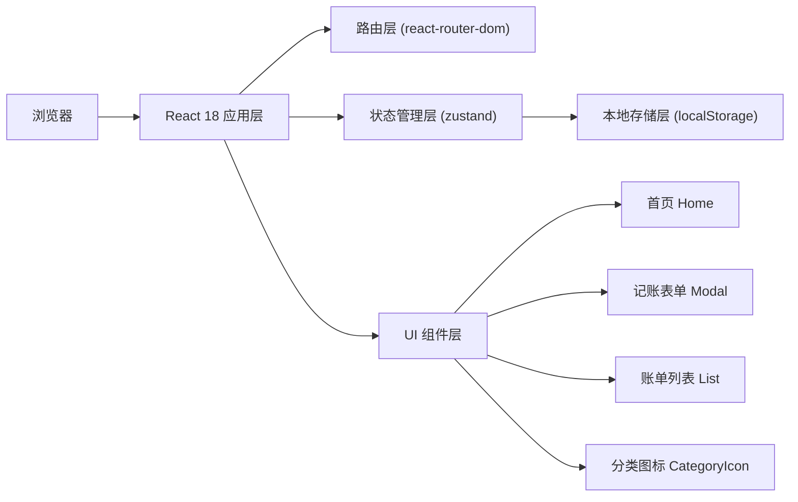
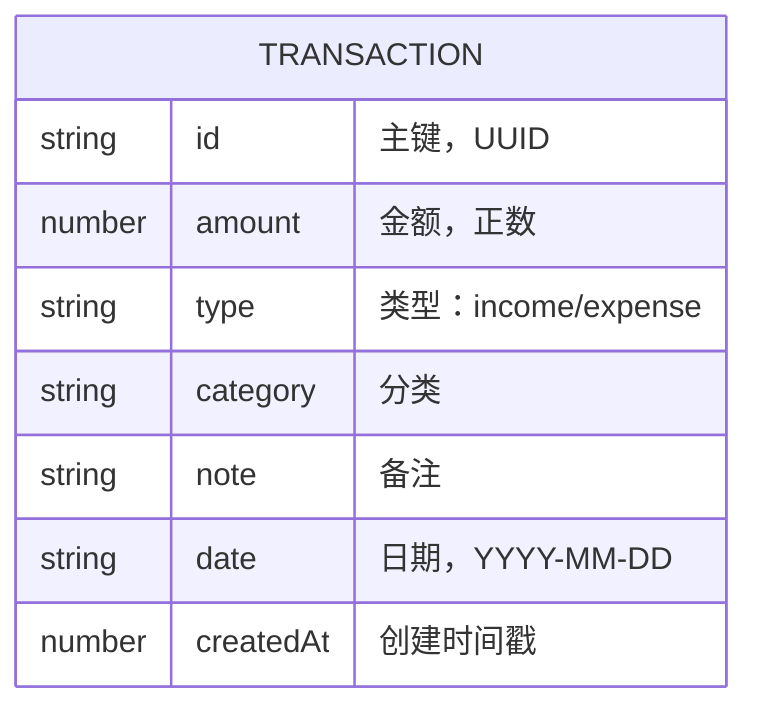

## 1. 架构设计



## 2. 技术描述

- **前端框架**：React@18 + TypeScript
- **构建工具**：Vite@5
- **样式方案**：TailwindCSS@3
- **路由管理**：react-router-dom@6
- **状态管理**：zustand@4
- **图标库**：lucide-react
- **数据存储**：浏览器 localStorage
- **包管理器**：npm

## 3. 路由定义

| 路由 | 用途 |
|-------|---------|
| / | 首页（记账入口 + 账单列表） |

## 4. 数据模型

### 4.1 数据模型定义



### 4.2 TypeScript 类型定义

```typescript
type TransactionType = 'income' | 'expense';

interface Transaction {
  id: string;
  amount: number;
  type: TransactionType;
  category: string;
  note: string;
  date: string;
  createdAt: number;
}

interface Category {
  key: string;
  label: string;
  icon: string;
  color: string;
}
```

### 4.3 分类配置

**支出分类**：
- 餐饮 (🍔)
- 交通 (🚗)
- 购物 (🛒)
- 娱乐 (🎮)

**收入分类**：
- 工资 (💰)
- 兼职 (💼)
- 其他 (📦)

## 5. 项目结构

```
src/
├── components/          # 组件目录
│   ├── Header.tsx       # 顶部导航栏
│   ├── BalanceCard.tsx  # 余额卡片
│   ├── TransactionForm.tsx  # 记账表单弹窗
│   ├── TransactionList.tsx  # 账单列表
│   └── TransactionItem.tsx  # 账单列表项
├── hooks/               # 自定义 hooks
│   └── useLocalStorage.ts  # localStorage 持久化 hook
├── store/               # 状态管理
│   └── useTransactionStore.ts  # 账单状态管理
├── types/               # 类型定义
│   └── index.ts         # 全局类型
├── utils/               # 工具函数
│   ├── categories.ts    # 分类配置
│   └── formatters.ts    # 格式化工具
├── pages/               # 页面组件
│   └── Home.tsx         # 首页
├── App.tsx              # 应用入口组件
├── main.tsx             # 应用入口
└── index.css            # 全局样式
```

## 6. 核心功能实现要点

### 6.1 localStorage 持久化

- 存储 key: `coinkeeper_transactions`
- zustand store 初始化时从 localStorage 读取
- 每次 state 变化时自动同步到 localStorage
- 监听 storage 事件，多标签页数据同步

### 6.2 表单校验

- 金额：必须 > 0，最多两位小数
- 分类：必填，根据类型切换可选分类
- 使用 HTML5 原生校验 + 自定义校验逻辑
- 错误信息实时显示

### 6.3 余额计算

- 总收入：所有 type = 'income' 的 amount 之和
- 总支出：所有 type = 'expense' 的 amount 之和
- 余额 = 总收入 - 总支出
- 使用 useMemo 缓存计算结果

### 6.4 账单列表排序

- 按日期倒序排列（YYYY-MM-DD 字符串可直接比较）
- 日期相同按创建时间戳倒序
- 可考虑按日期分组展示（可选增强）
